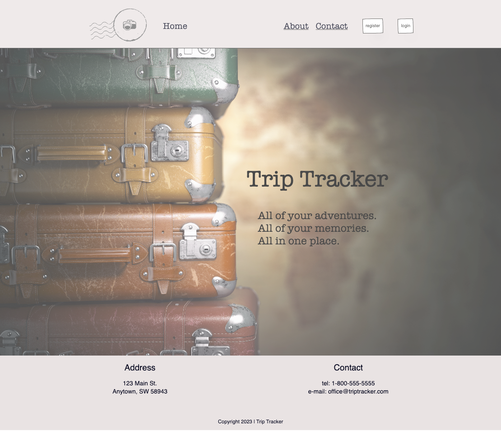

# TRAVEL-LOG APP (TRIP TRACKER)

A Travel Web-App for uploading, managing, and sharing trip documents and media using Next.js and REST APIs

## DESCRIPTION

This product is intended to be a user-friendly application that allows users to access and manage all documents and media associated with their individual trips. They should be able to view and manage their data all in one location with minimal need to navigate between pages. Each individual trip will display maps, itinerary, journal entries, and media based on date and location.



PRODUCT FEATURES

## PRIO 1

    - Login/ Registration page for authentication and authorization
    - A page with a list of users’ trips
    - An individual trip ‘dashboard’ allowing users to view that trips’ maps, itinerary, journal entries, and media
    - A restricted admin page allowing the trip creator to upload media and documents
    - A maps page that will display a map with locations pinned based on the date and location of users’ media and documents

## PRIO 2

    - Role system allowing users to share their private trips with others

## PRIO 3

    - Allow users to comment on and like other users’ trips

## TECHNOLOGIES USED

    - REST API
    - Next.js
    - Node.js
    - TypeScript

## SERVICES USED

    - Cloudinary (media upload)
    - Leaflet (map integration)

## DESIGNS

    - Wire Frame - https://www.figma.com/file/TV4DqiignvNwqUq9bpkQVh/Final-Project?type=design&node-id=2%3A2689&t=OIVGZBL6rjjiwGAH-1
    - Database Design –

https://drawsql.app/teams/doug-andrews-team/diagrams/trip-tracker - API Design -

This is a [Next.js](https://nextjs.org/) project bootstrapped with [`create-next-app`](https://github.com/vercel/next.js/tree/canary/packages/create-next-app).

## Getting Started

First, run the development server:

```bash
npm run dev
# or
yarn dev
# or
pnpm dev
```

Open [http://localhost:3000](http://localhost:3000) with your browser to see the result.

You can start editing the page by modifying `app/page.tsx`. The page auto-updates as you edit the file.

This project uses [`next/font`](https://nextjs.org/docs/basic-features/font-optimization) to automatically optimize and load Inter, a custom Google Font.

## Learn More

To learn more about Next.js, take a look at the following resources:

- [Next.js Documentation](https://nextjs.org/docs) - learn about Next.js features and API.
- [Learn Next.js](https://nextjs.org/learn) - an interactive Next.js tutorial.

You can check out [the Next.js GitHub repository](https://github.com/vercel/next.js/) - your feedback and contributions are welcome!

## Deploy on Vercel

The easiest way to deploy your Next.js app is to use the [Vercel Platform](https://vercel.com/new?utm_medium=default-template&filter=next.js&utm_source=create-next-app&utm_campaign=create-next-app-readme) from the creators of Next.js.

Check out our [Next.js deployment documentation](https://nextjs.org/docs/deployment) for more details.
